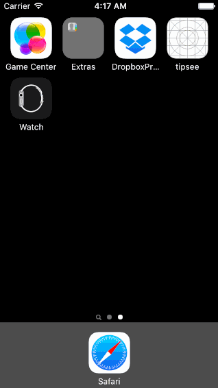

## Dropbox

The purpose of this homework is to use Xcode to implement the flow between the screens of an application. We're going to use the techniques from this week to implement the Dropbox app from the signed out state to the basic signed in state.

Time spent: `6.5 hours`

### Features

#### Required

- [x] User can tap through the 3 welcome screens.
- [x] User can follow the create user flow.
  - [x] On the create user form, the user can tap the back button to go to the page where they can sign in or create an account.
  - [x] Before creating the account, user can choose to read the terms of service.
  - [x] After creating the account, user can view the placeholders for Files, Photos, and Favorites as well as the Settings screen.
  - [x] User can log out from the Settings screen.
- [x] User can follow the sign in flow.
  - [x] User can tap the area for "Having trouble signing in?".
  - [x] User can log out from the Settings screen.

#### Optional

- [ ] Add a detail view for one of the files and implement favoriting the file.
- [ ] Add UITextFields for the forms so you can actually type in them and handle dismissing the keyboard.
- [ ] You should be able to swipe through the welcome screens instead of just tapping them.

Please list two areas of the assignment you'd like to **discuss further with your peers** during the next class (examples include better ways to implement something, how to extend your app in certain ways, etc):

1. how to better handle shared states across flow paths
2. add additional gestures like "long press"

### Video Walkthrough

Here's a walkthrough of implemented user stories:

GIF created with [LiceCap](http://www.cockos.com/licecap/).

## Notes

I was stuck for a bit on the Settings tab when there was extra padding above the Scroll View, which was ultimately resolved by toggling on and off "Adjust Scroll View Inserts" on the Settings View Controller.

## License

    Copyright 2016 Jonathan E. Chen

    Licensed under the Apache License, Version 2.0 (the "License");
    you may not use this file except in compliance with the License.
    You may obtain a copy of the License at

        http://www.apache.org/licenses/LICENSE-2.0

    Unless required by applicable law or agreed to in writing, software
    distributed under the License is distributed on an "AS IS" BASIS,
    WITHOUT WARRANTIES OR CONDITIONS OF ANY KIND, either express or implied.
    See the License for the specific language governing permissions and
    limitations under the License.
